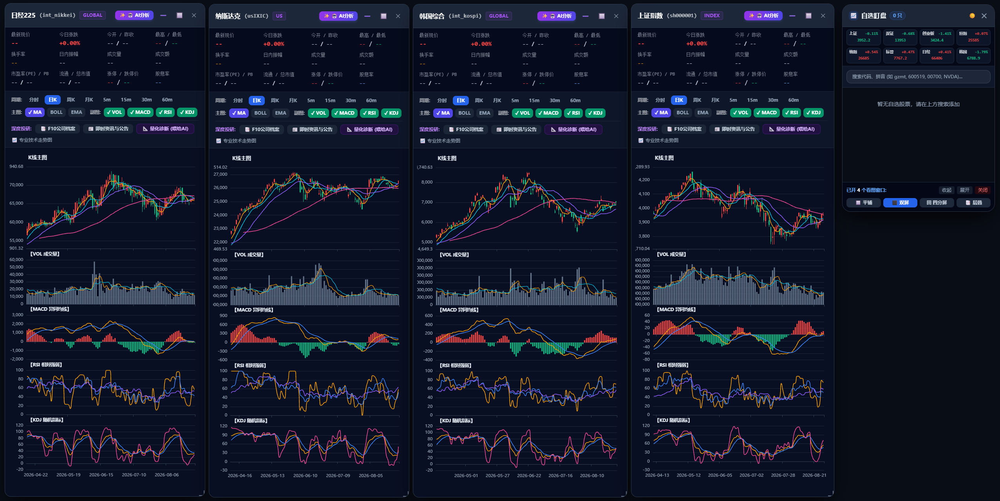
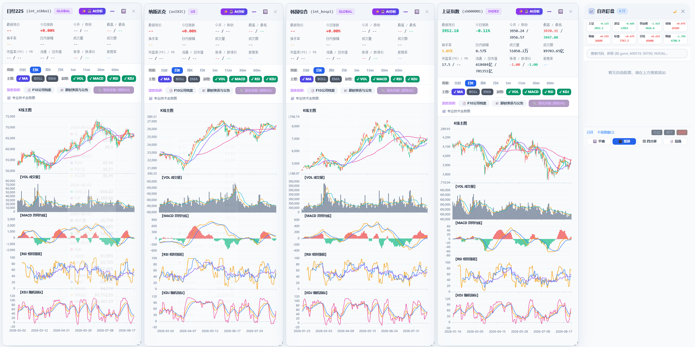

# 📈 dsh-plugin-stock-x (DeepSeek Harness 股票盯盘与量化投研插件)

<p align="center">
  
  
  
  
</p>

这是一个**纯 JavaScript / Node.js 实现、零外部运行依赖**的 **DeepSeek Harness (`dsh`) Web 宿主专属股票行情盯盘与量化投研插件**。

一键为你的 DeepSeek Harness 注入**摸鱼半透明悬浮球**、**自选股抽屉面板**、**全球 8 大核心指数实时看板**、**专业多周期 K 线/分时多窗口看板**，并深度打通 **“一键将股票投研诊断发送至 DSH 对话框进行深度分析”**。

---

## 📸 界面预览 (Screenshots)

<div align="center">
  <p><b>🌙 深色主题多窗口看盘工作台</b></p>
  
  <br/><br/>
  <p><b>☀️ 亮色主题多窗口看盘工作台</b></p>
  
</div>

---

## 🌟 核心特性

- ⚡ **纯 JS / 零外部运行依赖**：基于 Node.js 原生 API 与前端 Canvas/ECharts，无需配置 Python 环境或本地数据库。
- 🌏 **全市场实时行情**：全覆盖 **A股 (沪/深/北交所)、港股、美股与全球 8 大核心指数**。
- 🔍 **智能拼音与全市场检索**：支持拼音首字母（如 `gzmt` -> 贵州茅台）、全拼（`tengxun` -> 腾讯控股）、股票代码（`600519`, `00700`, `NVDA`）秒级搜索。
- 🔮 **摸鱼浅色磨砂悬浮球**：平时收缩为屏幕角落的精致小圆球（支持随意拖拽移动），点击瞬间平滑展开自选盯盘面板。
- ⚙️ **全局偏好与设置中心**：
  - 🌓 **视觉主题风格**：支持 `极客深色暗黑` 与 `清爽高雅亮白` 随心切换；
  - 🎨 **红绿/绿红国际化配色习惯**：支持 `🇨🇳 红涨绿跌 (A股/港股标准)` 与 `🌐 绿涨红跌 (美股/加密货币国际标准)`，图表/走势/盘口指标全量无缝换色；
  - ⏱️ **行情自动刷新频率**：支持 `2秒 (极速)` / `3秒 (标准)` / `5秒 (省流)` / `10秒` 自定义轮询；
  - 📦 **自选股数据备份与批量导入**：支持一键复制 JSON 结构化数据或纯代码列表，支持批量粘贴代码/名称一键全市场检索导入。
- 🏷️ **自选股市场分类与多维排序**：
  - 支持按 `全部` | `A股` | `港股` | `美股` | `指数` 药丸标签快速过滤；
  - 支持在 `默认排序` ➡️ `涨幅 ⬇` ➡️ `跌幅 ⬆` ➡️ `成交额 💰` 之间一键多维动态排序。
- 📊 **五档买卖深度挂单盘口**：
  - 实时高频提取并呈现买一~买五与卖一~卖五挂单价格与手数（支持万手智能换算）；
  - 挂单价格对比昨收价动态跟随红/绿配色，支持在窗口内一键折叠/展开。
- 📈 **K线十字光标联动实时 HUD 数据栏**：
  - 图表顶部常驻量化指标状态栏，光标在历史 K 线或分时走势上移动时，实时高频跳动展示该时刻的 `开/高/低/收/涨跌幅/量/MA/BOLL/MACD/RSI/KDJ` 数值，还原 TradingView 级别的读盘手感。
- 💼 **个人模拟持仓与浮动盈亏资产看板**：
  - 支持自选股录入买入成本均价（¥）与持有股数（股）；
  - 自动实时计算单股持仓市值、浮盈金额（¥）与收益率（%）；
  - 抽屉面板顶部自动汇总呈现个人投资组合的 `总资产市值`、`今日总盈亏` 与 `累计总浮盈`。
- 🔔 **目标价格突破与异动预警通知**：
  - 支持为关注标的设置 `突破上限目标价`、`跌破止损警戒价` 或 `单日异动涨跌幅阈值`；
  - 盘中触及阈值即刻在右下角弹出高亮 Toast 预警通知，防止踩雷或错过突破买卖点。
- 💬 **深度联动 DSH 对话窗口**：
  - **走势窗口顶栏一键发送**：点击「💬 发送到聊天」，自动将当前股票行情盘口、关键点位、最新资讯/公告超链接与提问提示词填入 DSH 对话框；
  - **AI 量化诊断一键提问**：点击「⚡ 一键提问AI」，直接向 DeepSeek 发起超深度投研诊断与仓位风控咨询；
  - **自选列表快捷咨询**：自选股列表右侧内置 `💬` 按钮，一键快速向 AI 咨询该股。
- 📊 **专业多窗口时序看图**：
  - 支持分时均价线 (VWAP)、日K、周K、月K及 5m/15m/30m/60m 分钟K线；
  - 智能周K/月K聚合引擎，确保冷门指数与跨国标的亦能顺畅看图；
  - 内置经典主图指标（MA 均线、BOLL 布林通道、EMA 指数均线）与副图指标（VOL 成交量、MACD 异同均线、RSI 相对强弱、KDJ 随机指标）；
  - 支持平铺、双屏、四分屏、层叠等多窗口智能布局与独立拖拽缩放。
- 📑 **企业 F10 档案与即时资讯**：秒级获取公司主营业务、关键财务中枢、最新公告与行业新闻（包含源链接）。

---

## 🚀 快速安装与使用指南

### 前置准备
- 安装 [Node.js](https://nodejs.org/) (`v18.0.0` 或更高版本)
- 安装 [DeepSeek Harness (`dsh`)](https://github.com/deepseek-ai)

---

### 第一步：克隆仓库并进入目录

```bash
git clone https://github.com/xuexiaolei1997/dsh-plugin-stock-x.git
cd dsh-plugin-stock-x
```

### 第二步：安装项目依赖

```bash
npm install
```

### 第三步：安装插件到 DSH Web Profile

在 `dsh-plugin-stock-x` 根目录下执行：

```bash
dsh plugin --profile web add file:.
```

> 💡 **提示**：如果使用完整绝对路径，也可以执行：
> ```bash
> dsh plugin --profile web add file:D:\你的插件目录路径\dsh-plugin-stock-x
> ```

### 第四步：启动 DeepSeek Harness Web 宿主

```bash
dsh web
```
*(或在 DSH 项目开发目录下执行 `pnpm dsh web`)*

启动后，打开浏览器访问 DSH Web 页面，右下角将出现**股票悬浮球**，点击即可开始实时盯盘！

---

## 🖥️ 独立运行模式（无需 DSH 亦可单独运行）

如果你只想作为独立的本地股票看盘工作台使用，直接在项目目录下执行：

```bash
npm start
```

启动后在浏览器打开：
- **独立看板工作台**：`http://127.0.0.1:3000`
- **网页嵌入测试 Demo**：`http://127.0.0.1:3000/demo`

---

## 🗑️ 卸载插件

如需从 DSH Web 环境卸载该插件，在终端执行：

```bash
dsh plugin --profile web remove dsh-plugin-stock-x
```

---

## 📂 项目结构

```text
dsh-plugin-stock-x/
├── index.js             # DSH/Cordis 插件服务端入口 (路由注册、提示词注入)
├── client.js            # DSH 浏览器端插件运行时 (悬浮球、自选抽屉、多窗口工作台)
├── cordis.patch.yml     # DSH Bundle 插件配置 Patch
├── stock-api.js         # 全市场实时行情、时序K线聚合、F10与智能搜索核心 SDK
├── server.js            # 独立本地 Web 服务器
├── package.json         # 模块声明与 DSH 插件配置
├── public/              # 独立前端静态资源 (app.js, indicators.js, index.html)
└── skills/              # 内置投研技能 (investment-research)
```

---

## 📄 开源协议

本项目采用 [MIT License](LICENSE) 协议开源，欢迎 Star 与贡献代码！
